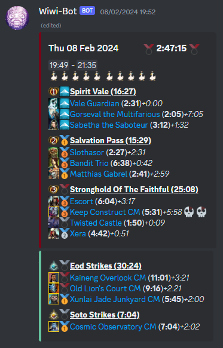
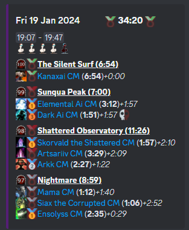
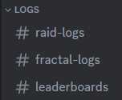

# Gw2 Log Manager
This log manager is specifically geared towards tracking clears within a raid static. It will upload logs to dps.report and create a discord message using webhooks with the run times. 
It compares the runs with previous results and show how you did.


For any questions or feature requests please feel free to slide into the discord server
[Wiwi's Corner](https://discord.gg/rwhFSzTS).

# Features
The log manager will create a discord message for a raiding or fractal session. It will post new logs every time there is one available.

### Static clears



(**4:41**) cleartime of the encounter\
_+1:07_ Time between the end of the previous kill run and the start of the current kill run. If its the first log in the session it will be 0:00, unless there is a fail log. \
 Medals indicate position on leaderboard, comparing the speed of that run with all historic runs.\
 5s slower than average\
 5s faster than average, but not in top 3\
 Wipe, red indicates how much health left. More red = lower boss health.\
\
Clicking the skull icon will also open the log of that run. Does not work on phone.\
 Amount of core members in the run.\
 Amount of pugs in the run.\
**35:25** Total runtime of combined runs. Only shows when all encounters have been successfully killed. Works for fractals and raids. For raids the whole week is checked. Fractals need to be cleared on the same day.

### Leaderboards
\
 Click the medal to go to the dps report.

# Installation
The log manager is built on a django framework with a local sqlite database, only tested on Windows. All we need is a local python environment to run the scripts. Below installation is done with miniforge, but feel free
to use any other python distribution to your liking.

## Software
<!-- 1. <s>Download the latest [release](https://github.com/wiwihere/wiwi-bot/releases)<\s> and place it anywhere. Unpack the zip. -->
1. Download this github page as zip (Code -> Download ZIP) and place it anywhere. Unpack the zip.
2. Install the python environment. Download [miniforge](https://github.com/conda-forge/miniforge). Make sure to tick the option to add python 3.10 to system path.
3. Run `Miniforge Prompt` as **admin**. And run the following code;
```
mamba env create -f "C:\Users\Wiwi\Documents\github\wiwi-bot\environment.yml" #Change to download location
```
4. Use the IDE of your choice if you need to debug errors or want a bit more control. I use [vs-code-insiders](https://code.visualstudio.com/insiders):\
    a. Install the python and jupyter extensions.\
    b. File -> Open Folder ->  select the folder with the unpacked zip from 1.\
    c. Open the file `wiwi-bot/gw2_database/scripts/import_dps_report.py`\
    d. On the bottom right click the python interpreter  and select the python env we installed at step 2; .\
    e. Run the code with `shift+enter` or by pressing  above the code blocks.

## Initial setup
A couple tokens and keys need to be set so the results can be posted to discord.
1. Rename `bot_settings\.env-example` to `bot_settings\.env`.
    - .env\CONDA_DIR -> rename `C:\Users\Wiwi\miniforge3` to your own conda or mamba installation (step 2 in software)
    - .env\DPS_REPORT_USERTOKEN -> place userToken from https://dps.report/getUserToken after = sign.
2. In discord we have 3 channels running. Create a webhook for each and copy the webhook URL into the env. 

    \
    Make sure to tick the option:\
    

    discord Server Setttings -> integrations -> Webhooks -> Copy Webhook URL
3. Within the leaderboards channel create threads for: `raids`, `strikes` and `fractals`.
- Get the thread id by right click -> copy link or  -> paste only the last 18 digit number in the .env.
4. Setup the database. Copy `gw2_datase/db-empty.sqlite3` to `gw2_datase/db.sqlite3`.
5. Add core members to the database, see [Add a core member](#add-a-core-member).

## Customization
Everything can be customized. Easiest way to make edits to the database is by firing up Django.

- Run `bin/django_runserver.bat.`
- Open http://127.0.0.1:8000/admin/
- user: wiwi, pw: wiwi-bot

#### Add a core member:
Add members to the players list to have them appear as a core member. 

- Go to the Players page; http://127.0.0.1:8000/admin/gw2_logs/player/ and add a new player:\


#### Add new encounter
When parsing a log from an encounter that is not in the database yet, the script will crash.
It will have to be added to the database:


#TODO add image of error report with boss id
